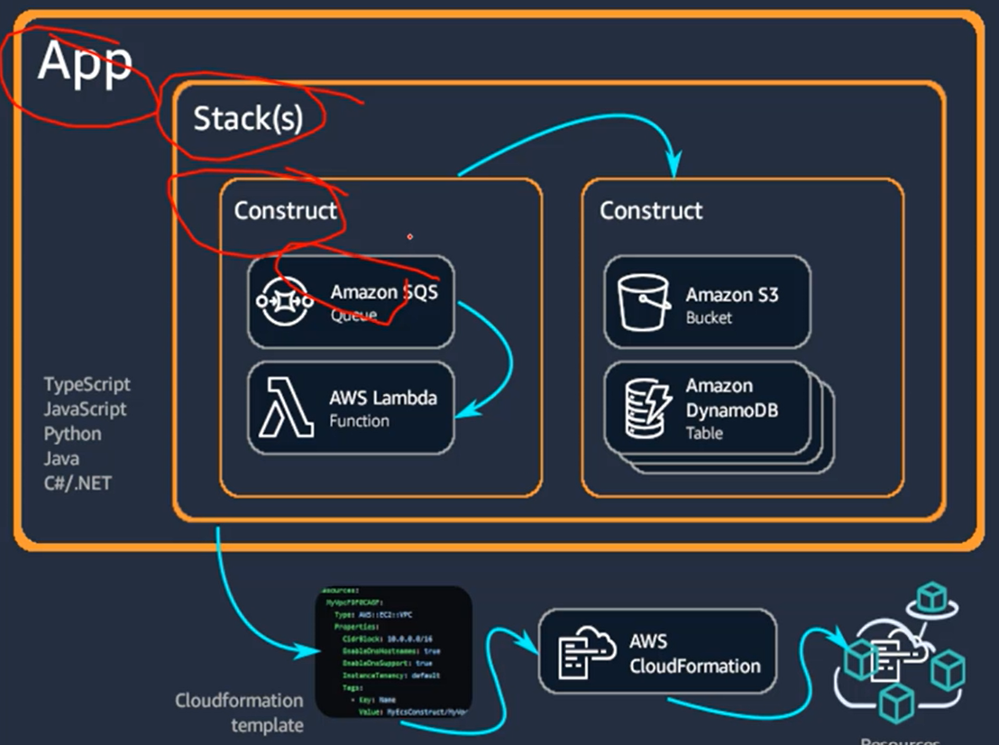
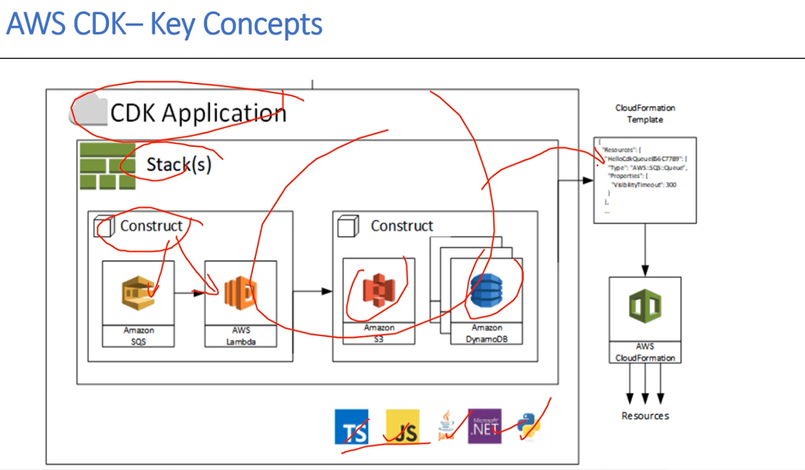

## CDK Concept

### aws cdk
1. app
- app serves as the project deliverables scope
- app is a container for one or more stack
- stack within a single app can easily refer to each other's resources

2. stack
- stack is a unit of deployment in cdk
- all resources define within the scope of a stack are provisioned as a single unit
- Similar to cloudformation stack

3. construct
- construct as basic building block od cdk apps.
- cdk includes a collection of construct called aws construct libraray
- a construct can represent single aws resources or multiple aws resources.
- Different  types of construct
    * L1: Provide all the required cloudformation attributes for a particular cloud resources.
    * L2: Don't need to provide every attribute , instead provide `sensible default` to easily spin up resources.
    * L3: Represent various cloud resources that work together to accomplish a aprticular task caled "pattern".
4. Resources
- Create instance of resources using its corresponding construct
- pass scope as th first arguents
- Logic ID of construct
- Set of configuration properties (props)


### Project structure
1. cdk.json
- Tells the AWS Toolkit(CLI) how to run your app. 
- npx ts-node --prefer-ts-exts bin/hello-lambda.ts
2. bin/cdk-workshop.ts
- Entrypoint of the CDK application. 
- Will load the stack defined in lib/cdk-workshop-stack.ts.
3. lib/cdk-workshop-stack.ts (Most Important File)
- Is where your CDK application’s main stack is defined. 
4. node_modules
- Is maintained by npm and includes all your project’s dependencies.
5. test/cdk-s3.test.ts
- All the test files are included here
6. .gitignore and .npmignore
- Tells git and npm which files to include/exclude 
7. package.json is your npm module manifest. 
- It includes information like the name of your app, version, dependencies
- build scripts like “watch” and “build” (package-lock.json is maintained by npm)
8. tsconfig.json your project’s typescript configuration
9. cdk.out CloudFormation template equivalent to our CDK stack

### PreRequisite
### Install the AWS CDK Toolkit for VS Code
- *https://docs.aws.amazon.com/toolkit for visual studio/latest/user guide/setup.html#install*

1. Install Node.js
2. typescript
```
npm install -g typescript
```
3. VSC
4. AWS account
5. AWS CLI

# Install aws-cdk
1. Install aws cdk
```
npm i -g aws-cdk
```
### Create folder for your project
1. Create fole name `cdk` 
2. create folder cdk-<resource name/project nam>
```
mkdir cdk-s3 && cd cdk-s3
```
3. Initialize cdk 
```
cdk init app --language typescript
```
4. Run for build the app
- AWS CDK—the Toolkit implements it but a good practice to build manually to catch syntax and type errors
```
npm run build
```
4. Create bootstrap
- Bootstrap (One Time) - Deploys the CDK Toolkit staging stack in S3 bucket
```
cdk bootstrap
```
5. Cdk synth to Synthesize an AWS CloudFormation template for the app
```
cdk synth
```
6. cdk deploy to create resources
- Deploy the stack using AWS CloudFormation)
```
cdk deploy
```
7. check diff
- The AWS CDK can update deployed resources after you modify your app
- To see these changes, use the cdk diff command
```
cdk diff
```
8. destory what you ceated
### Deletion Policy
- Destroy: Default deletion policy
- Retain: Retained in the account but orphaned from the stack.
- SNAPSHOT: delete the reource, but saves a snapshot of its data before deleting so that it can be recreated later.
```
cdk destroy
```
### deploy with env
#### edit bin/XXX.ts file
```
env: {account: '123456789', region: 'eu-north-1'}
```
### Ref
- Sample Code *https://github.com/aws-samples/aws-cdk-examples/*
- AWS Solution *https://docs.aws.amazon.com/solutions/latest/constructs/welcome.html*

### Ref Link
- *https://docs.aws.amazon.com/cdk/api/v2/docs/aws-construct-library.html*
