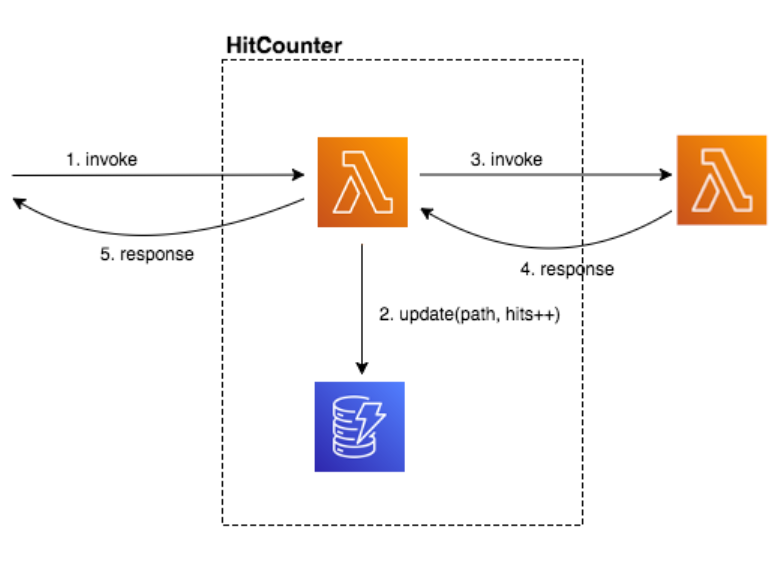

# Writing constructs
#### In this chapter we will define a new construct called HitCounter. This construct can be attached to any Lambda function that’s used as an API Gateway backend, and it will count how many requests were issued to each URL path. It will store this in a DynamoDB table.


## Define HitCounter API
1. Create a new file for our hit counter construct
- Create a new file under lib called hitcounter.ts
```js
import * as cdk from 'aws-cdk-lib';
import * as lambda from 'aws-cdk-lib/aws-lambda';
import { Construct } from 'constructs';

export interface HitCounterProps {
  /** the function for which we want to count url hits **/
  downstream: lambda.IFunction;
}

export class HitCounter extends Construct {
  constructor(scope: Construct, id: string, props: HitCounterProps) {
    super(scope, id);

    // TODO
  }
}
```
2. Create the file lambda/hitcounter.js
```js
const { DynamoDB, Lambda } = require('aws-sdk');

exports.handler = async function(event) {
  console.log("request:", JSON.stringify(event, undefined, 2));

  // create AWS SDK clients
  const dynamo = new DynamoDB();
  const lambda = new Lambda();

  // update dynamo entry for "path" with hits++
  await dynamo.updateItem({
    TableName: process.env.HITS_TABLE_NAME,
    Key: { path: { S: event.path } },
    UpdateExpression: 'ADD hits :incr',
    ExpressionAttributeValues: { ':incr': { N: '1' } }
  }).promise();

  // call downstream function and capture response
  const resp = await lambda.invoke({
    FunctionName: process.env.DOWNSTREAM_FUNCTION_NAME,
    Payload: JSON.stringify(event)
  }).promise();

  console.log('downstream response:', JSON.stringify(resp, undefined, 2));

  // return response back to upstream caller
  return JSON.parse(resp.Payload);
};
```

3. Add resources to the hit counter construct
- Go back to lib/hitcounter.ts and add the following highlighted code:
```js
import * as cdk from 'aws-cdk-lib';
import * as lambda from 'aws-cdk-lib/aws-lambda';
import * as dynamodb from 'aws-cdk-lib/aws-dynamodb';
import { Construct } from 'constructs';

export interface HitCounterProps {
  /** the function for which we want to count url hits **/
  downstream: lambda.IFunction;
}

export class HitCounter extends Construct {

  /** allows accessing the counter function */
  public readonly handler: lambda.Function;

  constructor(scope: Construct, id: string, props: HitCounterProps) {
    super(scope, id);

    const table = new dynamodb.Table(this, 'Hits', {
        partitionKey: { name: 'path', type: dynamodb.AttributeType.STRING }
    });

    this.handler = new lambda.Function(this, 'HitCounterHandler', {
        runtime: lambda.Runtime.NODEJS_14_X,
        handler: 'hitcounter.handler',
        code: lambda.Code.fromAsset('lambda'),
        environment: {
            DOWNSTREAM_FUNCTION_NAME: props.downstream.functionName,
            HITS_TABLE_NAME: table.tableName
        }
    });
  }
}
```

4. Add a hit counter to our stack
- Open lib/cdk-workshop-stack.ts and add the following highlighted code:
```js
import * as cdk from 'aws-cdk-lib';
import * as lambda from 'aws-cdk-lib/aws-lambda';
import * as apigw from 'aws-cdk-lib/aws-apigateway';
import { HitCounter } from './hitcounter';

export class CdkWorkshopStack extends cdk.Stack {
  constructor(scope: cdk.App, id: string, props?: cdk.StackProps) {
    super(scope, id, props);

    const hello = new lambda.Function(this, 'HelloHandler', {
      runtime: lambda.Runtime.NODEJS_14_X,
      code: lambda.Code.fromAsset('lambda'),
      handler: 'hello.handler'
    });

    const helloWithCounter = new HitCounter(this, 'HelloHitCounter', {
      downstream: hello
    });

    // defines an API Gateway REST API resource backed by our "hello" function.
    new apigw.LambdaRestApi(this, 'Endpoint', {
      handler: helloWithCounter.handler
    });
  }
}
```

5. Allow Lambda to read/write our DynamoDB table
- Go back to hitcounter.ts and add the following highlighted lines:
```ts
import * as cdk from 'aws-cdk-lib';
import * as lambda from 'aws-cdk-lib/aws-lambda';
import * as dynamodb from 'aws-cdk-lib/aws-dynamodb';
import { Construct } from 'constructs';

export interface HitCounterProps {
  /** the function for which we want to count url hits **/
  downstream: lambda.IFunction;
}

export class HitCounter extends Construct {

  /** allows accessing the counter function */
  public readonly handler: lambda.Function;

  constructor(scope: Construct, id: string, props: HitCounterProps) {
    super(scope, id);

    const table = new dynamodb.Table(this, 'Hits', {
        partitionKey: { name: 'path', type: dynamodb.AttributeType.STRING }
    });

    this.handler = new lambda.Function(this, 'HitCounterHandler', {
      runtime: lambda.Runtime.NODEJS_14_X,
      handler: 'hitcounter.handler',
      code: lambda.Code.fromAsset('lambda'),
      environment: {
        DOWNSTREAM_FUNCTION_NAME: props.downstream.functionName,
        HITS_TABLE_NAME: table.tableName
      }
    });

    // grant the lambda role read/write permissions to our table
    table.grantReadWriteData(this.handler);
  }
}
```
6. Grant invoke permissions in lib/hitcounter.ts
```ts
import * as cdk from 'aws-cdk-lib';
import * as lambda from 'aws-cdk-lib/aws-lambda';
import * as dynamodb from 'aws-cdk-lib/aws-dynamodb';
import { Construct } from 'constructs';

export interface HitCounterProps {
  /** the function for which we want to count url hits **/
  downstream: lambda.IFunction;
}

export class HitCounter extends Construct {

  /** allows accessing the counter function */
  public readonly handler: lambda.Function;

  constructor(scope: Construct, id: string, props: HitCounterProps) {
    super(scope, id);

    const table = new dynamodb.Table(this, 'Hits', {
        partitionKey: { name: 'path', type: dynamodb.AttributeType.STRING }
    });

    this.handler = new lambda.Function(this, 'HitCounterHandler', {
      runtime: lambda.Runtime.NODEJS_14_X,
      handler: 'hitcounter.handler',
      code: lambda.Code.fromAsset('lambda'),
      environment: {
        DOWNSTREAM_FUNCTION_NAME: props.downstream.functionName,
        HITS_TABLE_NAME: table.tableName
      }
    });

    // grant the lambda role read/write permissions to our table
    table.grantReadWriteData(this.handler);

    // grant the lambda role invoke permissions to the downstream function
    props.downstream.grantInvoke(this.handler);
  }
}
```
7. check diff
8. Deploy
9. test again the api url