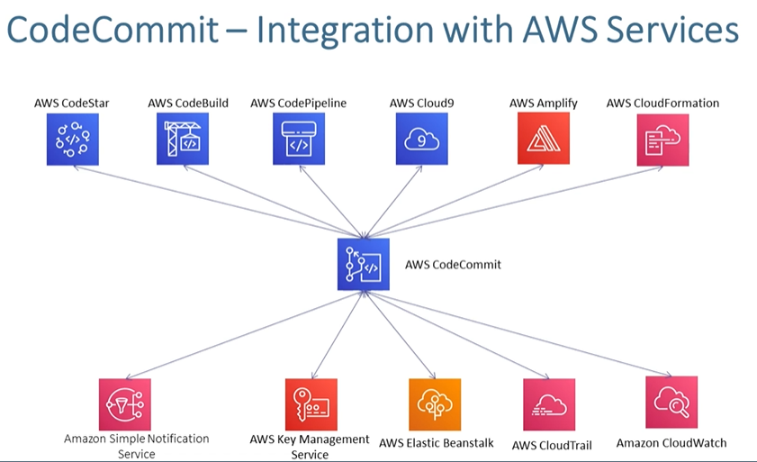

## 1. Code Commit Integrate


## 2. Create repo in Code Commit
#### Clone repo locally
#### Give user access to access codecommit locally
- IAM -> User -> **Select User**
- **Select Security Credentials**
- HTTPS Git credentials for AWS CodeCommit -> Generate Credentials
- Use That Credentials for CLone repo locally

#### Aws Managed Policy for Code commit
1. AWSCodeCommitFullAccess
2. AWSCodeCommitPowerUser
3. AWSCodeCommitReadOnly


## 3. Approval Rule Template For Pull Request
#### Step 1: Create PR rule template
- CodeCommit -> Approval rule templates
    - Name
    - Number of Approval Needs
    - Approval pool members
    - Associated repositories: select the repo
#### Step 2: Define IAM user who have access to approve

## 4. Code Commit Notification
- Get Notification on email, sns
    - CodeCommit -> Settings -> Notifications
    - **Create notification rule**
    - Notification Name
    - Events that trigger notifications
    - Target
        - sns, aws chatbot(Microsoft team, slack)
    ## Successfully get the Notification Mail

### Granularly Define CodeCommit Access

## Using IAM Policy assign granular access to codecommit
1. allow access to codecommit with ResourceTag Condition
    - Tag the repo with the key vakue and give condition in policy
    - Give user Permision with below policy
```json
{
    "Version": "2012-10-17",
    "Statement": [
        {
            "Sid": "Statement1",
            "Effect": "Allow",
            "Action": [
                "codecommit:*"
            ],
            "Resource": [
                "*"
            ],
            "Condition": {
                "StringEquals": {
                    "aws:ResourceTag/purpose": [
                        "study"
                    ]
                }
            }
        }
    ]
}
```
2. Deny all access to a repository with tag Status as Secret
3. Allow Access to reposiory only in Mumbai Region
4. Allow user only connecting from 10.77.2.50 to connect to repository
5. Deny Push actions to master branch
    - Add policy to user
```json
{
    "Version": "2012-10-17",
    "Statement": [
        {
            "Sid": "Statement1",
            "Effect": "Deny",
            "Action": [
                "codecommit:PutFile",
                "codecommit:GitPush"
            ],
            "Resource": [
                "*"
            ],
            "Condition": {
                "StringEquals": {
                    "codecommit:References": [
                        "refs/heads/master"
                    ]
                }
            }
        }
    ]
}
```
6. User with deny KMS access not able to view code as CodeCommit repo encrypted using KMS key
    - create user
    - add pplicy: **AwsCodeCommitFullAccess**
    - Create repo in codecommit
    - Add policy to user, deny kms access
    - Even User have access to codecommit, unable to view code, as code is encypted using KMS key, and user dont have acces to KMS
    - **policy**
```json
{
    "Version": "2012-10-17",
    "Statement": [
        {
            "Sid": "Statement1",
            "Effect": "Deny",
            "Action": [
                "kms:*"
            ],
            "Resource": [
                "*"
            ]
        }
    ]
}
```
**************************************************
# Code Commit Integrated with Various Aws resouces
- lambda, Event Bridge, CloudTrail, AWS KMS, and etc
- Cloudtrail, to insight capture activity by Users
**************************************************

**************************************************
# Data Protection
### Encrypt the data using KMS key and store the data into repo
### by default all repo is encrypted using **aws/codecommit** kms key
****************************************************
```json
{
    "Version": "2012-10-17",
    "Statement": [
        {
            "Sid": "Statement1",
            "Effect": "Allow",
            "Action": [
                "codecommit:ListRepositories",
                "codecommit:ListRepositoriesForApprovalRuleTemplate",
                "codecommit:ListPullRequests",
                "codecommit:ListBranches",
                "codecommit:ListAssociatedApprovalRuleTemplatesForRepository",
                "codecommit:ListApprovalRuleTemplates",
                "codecommit:ListTagsForResource"
            ],
            "Resource": [
                "*"
            ]
        }
    ]
}
```
************************************
# Git Branching Model
**************************************
# Pull Request


## Validating PR with codebuild
1. developer create PR to merge into master
2. Creating of PR will trigger CLoudWatch Events which invoke Lambda and Code build
3. COde build will test and validate the changes
4. Once build completes, CW events detects it, The outcomes is updated in PR
### Steps
1. Create stack in CF using base-template.yaml
2. Create stack in CF using pipeline.yml
