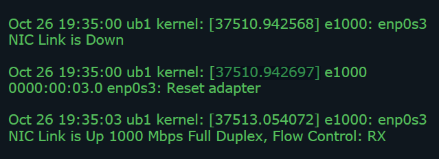
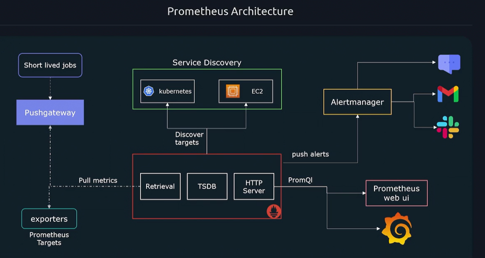

## What is Observability
- Observability – The ability to understand and measure the state of a system based upon data generated by the system
- Observability allows you to generate actionable outputs from unexpected scenarios in dynamic environments
- Observability will help:
1. Give better insight into the internal workings of a system/application
2. Speed up troubleshooting
3. Detect hard to catch problems
4. Monitor performance of an application
5. Improve cross team collaboration

## Trouble Shooting
- When it comes to troubleshooting issues, we need more information than just what is wrong.
- We need to know why our application entered a specific state, what component is responsible and how we can avoid it in the future
    - Why are error rates rising
    - Why is there high latency
    - Why are services timing out 
- Observability gives you the flexibility to understand unpredictable events

## How do we accomplish observability?
1. Logging
2. Metrics
3. Traces

### Logging
- Logs are records of events that have occurred and encapsulate information about the specific event
- Logs are comprised of:
    1. Timestamp of when the log occurred
    2. Message containing information



### Traces
- Traces allow you to follow operations as they traverse through various systems & services
- So we can follow an individual request and see it flow through our system hop by hop 
- Traces help us connect the dots on how processes and services work together
- Each trace has a trace id that can be used to identify a request as it traverses the system 
- Individual events forming a trace are called spans
- Each span tracks the following:
    1. Start time
    2. Duration
    3. Parent id

### Metrics
- Metrics provide information about the state of a system using numerical values
    - CPU Load
    - Number of open files
    - HTTP response times
    - Number of errors
- The data collected can be aggregated over time and graphed using visualization tools to identify trends over time
- Metrics contain 4 pieces of information:
    1. Metric name
    2. Value most recent or current value of the metric
    3. Timestamp for the metric
    4. Dimensions additional information about the metric
```t
# Metric Name               Dimensions                       Value  Time
node_filesystem_avail_bytes{fstype="vfat",mountpoint="/home"} 5000 4:30AM
```
## Prometheus
- Prometheus is a monitoring solution that is responsible for collecting and aggregating metrics
- Prometheus is an open source monitoring tool that collects metrics data, and provide tools to visualize the collected data alerts when metrics reach
- In addition, Prometheus allows you to generate a user specified threshold 
- Prometheus collects metrics by scraping targets who expose metrics through an HTTP endpoint
- Scraped metrics are then stored in a time series database which can be queried using Prometheus’ built in query language PromQl
### So what kind of metrics can Prometheus Monitor?
- CPU/Memory Utilization
- Disk space
- Service Uptime
- Application specific data
    - Number of exceptions
    - Latency
    - Pending Requests

### Prometheus is designed to monitor time series data that is numeric
### What type of data should Prometheus not monitor
- Events
- System logs
- Traces
### Ref for documentation *prometheus.io/docs*

### Architecture
1. **Scraped metric data**: Responsible for collecting metrics from target
2. **Stores metric data**: all data of metrics stores here
3. **HTTP server**: retrieve the data from stores metris data using PromQL query
4. exporter: run on teraget so prometheus can easily pull the metric data by pull metric
5. pushgateway: to pull short lived job
6. Service Discovery: List of target for promethues scapes
7. Alertmanager: for alert on sms, email
8. prometheus web ui: for view the data (alernate we can use grafana)



#### Prometheus collects metrics by sending http requests to /metrics endpoint of each target
#### Prometheus can be configured to use a different path other then /metrics
#### Most systems by default don’t collect metrics and expose them on an HTTP endpoint to be consumed by a Prometheus server
#### Exporters collect metrics and expose them in a format Prometheus expects
#### Prometheus has several native exporters 
    - Node exporters(Linux servers)
    - Windows
    - MySQL
    - Apache
    - HAProxy
#### Can we monitor application metrics
    - Number of errors/exceptions
    - Latency of requests
    - Job execution time Prometheus
#### comes with client libraries thatallow you to expose any application metrics you need Prometheus to track 
    - Language support:
- Go
- Java
- Python
- Ruby
- Rust